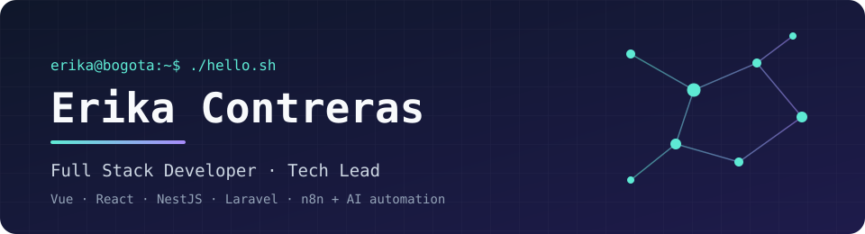
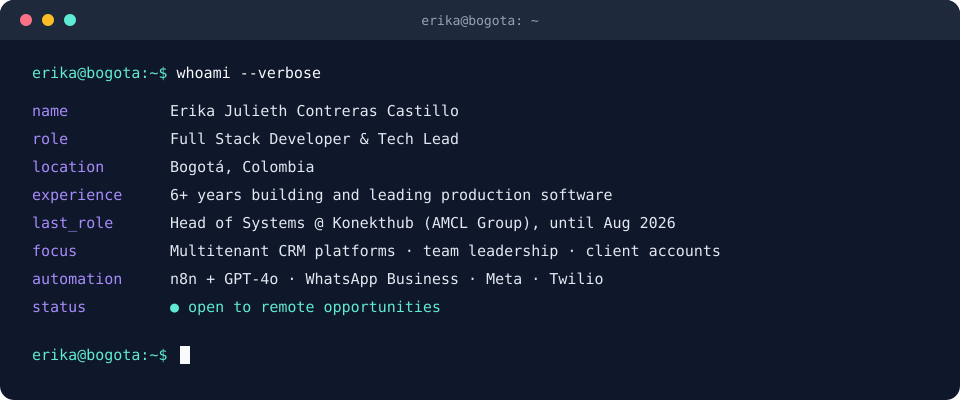

 

---

## `$ whoami`

  

 

## `$ cat tech-stack.yaml`

<table border="1" cellpadding="14">
  <thead>
    <tr>
      <th colspan="2" align="left"><code>erika:~$ cat tech-stack.yaml</code></th>
    </tr>
  </thead>
  <tbody>
    <tr>
      <td width="50%" valign="top"><code>├─ ✦ frontend:</code>  
         
        <code>Vue.js · Nuxt · React · JavaScript · TypeScript · Tailwind CSS</code>
      </td>
      <td width="50%" valign="top"><code>├─ ⚙ backend:</code>  
         
        <code>Node.js · NestJS · PHP · Laravel · Python</code>
      </td>
    </tr>
    <tr>
      <td valign="top"><code>├─ ▣ data:</code>  
         
        <code>PostgreSQL · MySQL · Firebase/Firestore · Redis</code>
      </td>
      <td valign="top"><code>├─ ☁ infra:</code>  
         
        <code>Docker · GCP · GitHub Actions · Nginx · PM2</code>
      </td>
    </tr>
    <tr>
      <td colspan="2" valign="top"><code>╰─ ⌁ automation_ai:</code>  
        &nbsp;
        &nbsp;
         
        <code>n8n · OpenAI GPT-4o · WhatsApp Business API · Meta Business Suite · Twilio</code>
      </td>
    </tr>
  </tbody>
  <tfoot>
    <tr>
      <td colspan="2"><code>status: ready&nbsp;&nbsp;·&nbsp;&nbsp;environment: production</code></td>
    </tr>
  </tfoot>
</table>

---

## `$ git log --career`

<table>
  <tr>
    <td valign="top"><code>HEAD</code></td>
    <td><b>Tech Lead / Full Stack Developer @ Konekthub (AMCL Group)</b> 
    Led the Systems Department and a multitenant, AI-powered CRM platform. Main technical contact for multiple client accounts (Element Insurance, Partner Group, Unity Financial).</td>
  </tr>
  <tr>
    <td valign="top"><code>HEAD~1</code></td>
    <td><b>Full Stack Developer @ Cooweb</b> 
    Grew from junior to senior. Led the Element Insurance CRM (Vue.js, NestJS, Firebase, PostgreSQL) and designed its sales pipeline and role-based access control for 8+ user roles.</td>
  </tr>
  <tr>
    <td valign="top"><code>HEAD~2</code></td>
    <td><b>Full Stack Developer &amp; Project Lead @ Exiware</b> 
    Led development and project management for the technical team.</td>
  </tr>
</table>

---

## `$ ls ~/projects`

<table>
  <tr>
    <td width="50%" valign="top">
      <a href="https://github.com/ErikaContrerasS/SamuLearn"><b>📚 SamuLearn</b></a> 
      An educational platform born at home, now connecting teachers, parents, and students in one place.  
      <code>React · Tailwind CSS</code>
    </td>
    <td width="50%" valign="top">
      <a href="https://github.com/ErikaContrerasS/curriculum"><b>📄 curriculum</b></a> 
      My personal interactive CV / resume website.  
      <code>React · TypeScript · Tailwind CSS</code>
    </td>
  </tr>
</table>

---

## `$ connect --socials`

&nbsp;&nbsp;

 
 

Made with 💜 and lots of coffee from Bogotá, Colombia · @ErikaContrerasS

